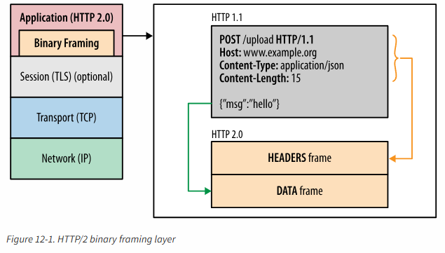

# 一：网络技术概览
## 延迟和带宽

延迟 = 传播延迟 + 传输延迟 + 处理延迟 + 排队延迟

目标：高带宽、低延迟
> CDN: 通过将内容部署到离用户最近的地方，降低传播延迟

## TCP
负责在不可靠的传输信道上提供可靠的抽象层，向应用层隐藏了大多数网络通信的复杂细节：丢包重发、按序发送、拥塞控制及避免、数据完整等。

三次握手：建立 TCP 连接

- 客户端可以在发送 ACK 后立即发送数据，服务器必须等到接收到 ACK 后才能发送数据

**重用连接**称为提升 TCP 性能的关键。

**队首阻塞**：应用层必须等待所有分组数据全都到达才能访问数据，底层的分组重发等问题都反应为延迟交付
- 导致无法预知的延迟，被称为抖动
- 对延迟或抖动要求很高的应用程序，最好选择 UDP 等协议

服务器的TCP配置实践：
- 增加TCP的初始拥塞窗口
- 慢启动重启
- 窗口缩放
- TCP快速打开

## UDP
UDP 只增加4字段：源端口、目标端口、分组长度和校验和
- 不保证消息交付
- 不保证交付顺序
- 不跟踪连接状态
- 不需要拥塞控制

所有消息的保证都交给应用层来控制
## TLS
TLS 的目标：加密、身份验证、数据加密

密钥协商、身份认证（PKI）、消息分帧（MAC，判断消息的完整性和可靠性）

由于需要提供额外的信息，需要进行 TLS 握手来建立加密信道，协商内容包括：TLS版本、加密套件、验证证书

1. 建立 TCP 连接
2. 客户端发送规格说明：TLS版本、支持的加密套件列表、希望使用的TLS选项
3. 服务器从客户端提供的加密套件中选择一个，再附上自己的整数，选择相同的TLS协议，将响应发送回客户端。作为可选项，服务器也可以发送请求，要求客户端提供证书及其他TLS扩展参数
4. 在确定共同的版本和加密套件后，客户端提供自己的证书给服务器，然后客户端生成一个新的对称密钥，用服务器的公钥加密发送给服务器
5. 服务器解密出客户端的对称密钥，通过MAC检测完整性后，返回给客户端加密的 Finished 消息
6. 客户端利用之前生成的对称密钥解密这条消息，验证MAC，如果一切都正确，则开始发送应用数据

ALPN 应用层协议协商：在TLS握手时，协商应用层协议，在ClientHello消息中追加一个新的ProtocolNameList字段，用来包含客户端支持的协议

TLS会话恢复：在多个连接间共享协商后的安全密钥，利用协商好的会话标识符，来重用之前协商的会话数据

# 二：无线网络性能
TODO

# 三：HTTP
HTTP 历史：HTTP0.9 ---> HTTP1.0(最佳实践和共用模式的RFC)---> 标准化的 HTTP1.1 ---> HTTP2(改进传输性能) ---> HTTP3

HTTP1.1引入了大量性能优化的特性：
1. 持久化连接以支持连接重用: 减少建立TCP连接的时间
2. 分块传输编码以支持流式响应
3. 请求管道(pipeline)以支持并行请求处理: 将请求的FIFO队列从客户端迁移到服务器，服务器可以在处理完第一次请求后，立即处理第二次请求（使用多线程，可以并发或并行来处理多个请求），消除**发送请求和响应的等待时间**
    - 缺点：只能严格串行的返回响应，只有当一个响应到达后，才会传输下一个响应（谁先请求，谁先发送）
    - 队头阻塞问题：CSS和HTML同时到达，先处理CSS请求，再处理HTML请求，CSS请求需要40ms，HTML请求需要20ms，但HTML请求也需要等待CSS请求的响应到达后才能开始发送
4. 字节服务以支持 range-based 的资源请求
5. 改进的更好的缓存机制

> 通过多个连接来提升性能，浏览器限制对同一个域名最多6个连接，可以使用域名分区来解决

HTTP 的首部可扩展性，为传输带来了负担
## HTTP2

1. 支持多路复用来减少延迟
- 需要提供流量控制
2. 压缩HTTP首部来降低传输开销
3. 增加请求优先级和服务器主动推送

- 一个HTTP1.1请求分为：头部二进制帧 + 数据二进制帧
- 在请求中会有各种控制二进制帧

stream: 建立的连接上的双向字节流
message: 对应于逻辑消息的完整的一系列数据帧
frame: 通信的最小单位，每个帧包括：frame 头 + frame 体

- 请求消息只包括一个header帧
- 响应消息包括header帧+data帧

客户端和服务器可以将HTTP消息分为相互不依赖的帧，然后乱序发送，再在另一端有序的组合起来：

- 上面的连接有3个请求/响应在并行交换
- 解决队首阻塞的问题

请求优先级：优化帧的交错和传输顺序，服务器可以根据优先级来控制资源分配，在响应数据准备好之后，优先发送最高优先级的帧
- HTTP2没有规定处理优先级的具体算法，客户端明确指定优先级值，服务器根据该值来处理和交付数据

> 每个源一个连接，减少了资源占用：套接字管理工作量减少、内存占用减少、连接吞吐量增大

流量控制：
- 基于每一跳进行，而非端到端控制
- 基于window_update帧进行，接受方广播自己准备接收的字节数

服务器推送：将资源直接推送给客户端，而无需客户端请求

首部压缩：

缺点：
- 消除了HTTP队首阻塞，但仍然存在TCP层次上的队首阻塞
- TCP窗口缩放被禁用，则会限制连接的吞吐量
- 丢包时，TCP拥塞窗口会缩小

帧头格式

帧类型：
- DATA
- HEADERS
- PRIORITY
- RST_STREAM
- SETTINGS
- PUSH_PROMISE
- PING
- GOAWAY
- WINDOW_UPDATE
- CONTINUATION
