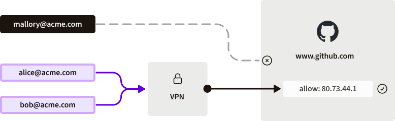
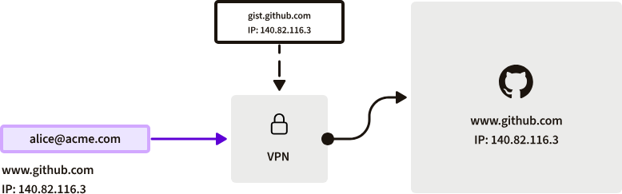
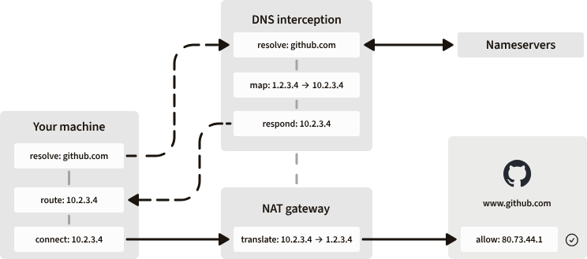
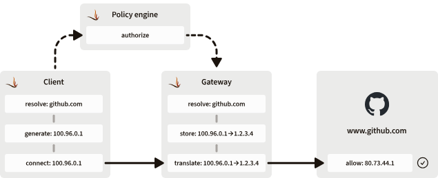

翻译: https://www.firezone.dev/blog/how-dns-works-in-firezone

# DNS
```bash
nslookup github.com
```
结果如下：
```bash
;; Got recursion not available from 172.18.176.1
Server:         172.18.176.1
Address:        172.18.176.1#53

Non-authoritative answer:
Name:   github.com
Address: 20.205.243.166
```

## 工作原理
从高层次来看，DNS 是一个分层系统，它将解析完全限定域名 (FQDN) 的责任分配给一系列 name servers，每个name server 负责解析不同的部分。


以下是其工作原理的简要概述：
1. 应用程序发出查询请求。第一站是 stub 解析器，它是主机上的一小段软件，负责解析系统上的所有 DNS 查询。
2. stub 解析器将查询转发到上游解析器。这通常是由您的 ISP 运行的缓存解析器（或者最近是 NextDNS 或 Cloudflare 等公共 DNS 服务）。
3. 如果查询未找到缓存，上游解析器将开始完整的解析过程。它会将查询转发到一系列连续的name server，每个名称服务器负责解析 FQDN 的不同部分。
    - 首先是 Root name server
    - 然后是 TLD 名称服务器
    - 最后是权威名称服务器
4. 权威 name 服务器使用相关主机的 IP 地址进行响应，上游解析器将最终结果返回给最初发出查询的主机上的 stub 解析器。
5. 主机上的应用程序现在可以连接 stub 根解析器返回的 IP 地址。

在当今的互联网上，解析查询的整个过程通常需要几百毫秒。缓存解析器通过将查询结果存储一段时间（称为记录的生存时间 (TTL)）来帮助加快这一过程。

因此，如果主机多次进行相同的查询，上游解析器可以立即返回结果（假设 TTL 尚未过期），而无需再次查询根、TLD 和权威名称服务器的层次结构。这可以将查询时间加快几个数量级，以至于上游解析器几乎可以即时使用缓存响应进行响应。

## DNS 的安全问题
问题是，DNS 是在 ARPANET 还是一个小型的、值得信赖的研究机构和政府机构网络时设计的。**该系统的设计假设网络上的所有实体都是已知的，并且网络本身是安全的**。

然而，随着 ARPANET 逐渐发展成为互联网，这一假设不再成立。自从 DNS 首次推出以来，两个常见的安全问题：DNS 欺骗和DNS 枚举。

DNS欺骗：DNS 的一个显而易见的安全问题是 **必须信任正在查询的域名服务器**。如果恶意行为者设法破坏您和域名服务器之间的任何部分路径，他们可以对您的查询返回错误的响应。由于您的机器没有其他方法来验证权威答案，它会连接到恶意域名服务器返回的任何 IP 地址。
- DNSSEC 可保证查询响应的完整性，而 DNS-over-TLS (DoT)和 DNS-over-HTTPS (DoH)则更进一步，可防止窃听者看到您执行的查询。

DNS枚举：
- 上面方法是保护响应，
- 如何保护 name 服务器免受查询本身的影响

例如，如果某个组织为其内部服务定义了记录，那么任何人都可以查询其权威名称服务器，以列出该组织所有内部服务的列表。

这称为DNS 枚举，是恶意行为者寻找组织潜在入口点时通常采取的第一步。由于此问题，组织通常会运行自己的名称服务器，并配置为根据请求的来源返回不同的结果（有时根本不返回） 。此技术称为 **Split DNS**。

### Split DNS 的原理
组织会维护两个（或更多）独立的名称服务器（或配置两个“区域”的单个名称服务器），一个用于内部资源，一个用于外部资源。内部服务器仅供连接到组织内部网络（例如 VPN 或分支机构网络）的用户访问，而外部服务器可供外界访问。


举个例子，假设一个组织有一个名为 的内部服务， gitlab.company.com其内部地址为10.10.10.10。该组织的内部名称服务器将配置为响应 VPN 或分支机构工作人员对此服务的查询，但外部名称服务器只会返回NXDOMAIN，DNS 表示“未找到”。这允许该组织公开发布一些记录，例如www.company.com，以便其网站可供公众访问，同时将其私有资源的地址保密。


剩下的就是在您的员工机器上进行一点 DNS 配置，以确保向正确的服务器查询正确的域，然后您就设置好了。

对于希望确保自身内部应用程序安全访问的组织而言，拆分 DNS 是一个很好的构建模块，并且目前仍然是缓解枚举攻击的一种流行方法。

**局限性**：
当您明确区分外部和内部资源时，拆分 DNS 非常有用。它允许您为公共资源发布公共地址，以便任何人都可以访问它们，并为您的员工发布私有地址，以便他们可以连接到您管理的私有资源。

然而，在许多组织中，云交付服务正日益取代其内部部署服务。这样做的好处通常是降低运营成本——向软件制造商付费，让他们为您托管软件，而不是自己托管和管理软件，并以降低成本的形式获得效率优势。

但缺点是曾经属于内部的资源现在被公开。任何拥有正确凭据的人都可以从世界任何地方访问您组织的代码存储库、CRM 数据或 CI/CD 机密。由于这些服务现在公开可用，它们不再具有内部地址，并且没有内部地址可解析，拆分 DNS 不再有用。

### VPN
事实证明，这个问题的解决方案如今越来越普遍：IP 允许列表。许多第三方 SaaS 应用（如 GitHub、Slack 和 Hubspot）允许您配置允许访问服务的源 IP 地址列表。
- 通过 VPN 跳转主机或办公室路由器路由这些服务的员工流量，通过添加到 SaaS 提供商允许列表中的静态 IP 传出流量



虚拟托管是一种在单个 IP 地址上托管多项服务的技术。它已成为应对 IPv4 地址枯竭的重要工具，也经常用于 IPv6 网络。

如果我们只是解决github.com然后将我们的 VPN 配置为通过跳转主机路由该 IP 地址的流量，我们可能会无意中路由gist.github.com、api.github.com或raw.githubusercontent.com的流量！



这就产生了一个问题：任何与其他服务共享 IP 地址的服务都无法使用简单的 IP 允许列表方法来保护。


**NAT**
因此，我们不能简单地解析服务 IP 地址并按原样路由它们。我们需要以某种方式转换它们，以确保它们不会与我们不想路由的服务的解析地址冲突。进入 NAT：网络地址转换。

我们可以通过拦截对服务的 DNS 查询来解决上述问题，为其生成一个唯一的 IP 地址而不是实际的 IP 地址，然后在 jumphost 之后添加一点 NAT，将生成的 IP 地址转换回服务的实际 IP 地址。

这解决了为错误服务路由流量所带来的附带损害问题，但却带来了一个新问题：我们需要一种方法来拦截我们试图保护的服务的 DNS 查询，动态地为它们生成一个唯一的 IP，然后以某种方式将相关流量通过正确配置的 NAT 网关路由到有问题的服务。



看起来很复杂，不是吗？保持所有这些同步和最新将是一场配置噩梦。我们将最初的 DNS 问题转化为配置问题。但幸运的是，配置问题往往更容易解决。


### 基于DNS的流量路由
Firezone 的 DNS 方法旨在将拆分 DNS 对内部服务的优势与 IP 允许列表公共服务的路由优势结合起来。让我们看看如何做到这一点。

还记得我们之前介绍的存根解析器吗？回想一下，它是主机上的一小段软件，负责解析系统上的所有 DNS 查询。好吧，每个 Firezone 客户端都嵌入了一个微小的轻量级存根解析器，其工作原理与操作系统提供的解析器一样，但有一个特殊的变化。

对于与任何 Firezone 定义的资源都不匹配的 DNS 查询，它的运行方式与任何其他存根解析器一样，将查询转发到系统的默认名称服务器，就像 Firezone 不存在一样。但是，对于与定义的资源匹配的 DNS 查询，它的行为略有不同。

我们的特殊存根解析器不会将查询转发到您的默认名称服务器，而是为资源生成一个特殊的内部 IP 并立即做出响应，并将该 IP 存储在查找表中。

当看到通过隧道的数据包与查找表中的 IP 相匹配时，客户端会向策略引擎生成请求以授权流量。如果获得批准，策略引擎会将与资源相对应的 IP 和 DNS 名称转发到可用于提供资源的网关。

然后，网关解析资源的实际 IP 地址（使用其 存根解析器）并存储它与我们之前生成的特殊内部 IP 之间的映射。

当网关看到特殊的内部 IP 的流量时，它会将其转换回资源的实际 IP，并将流量转发到资源。



现在，当应用程序将数据包发送到虚拟 IP 时，它们将通过新建立的 Firezone 隧道路由到解析查询的网关。然后，网关将此流量转发到公共服务，将源地址设置为我们在服务允许列表中配置的静态 IP（实现前面提到的 NAT 功能），现在我们已通过 Firezone 将流量路由到服务，而不会影响共享其 IP 的任何其他服务。


所有这些事情发生的时间与不使用 Firezone 解决查询所需的时间大致相同，因此应用程序（和最终用户）都不会意识到。

查询通过 Firezone 的控制平面通过安全的 WebSocket 传输进行解析，从而防止前面提到的欺骗攻击。而且由于实际解析发生在受保护环境中运行的网关上，因此枚举攻击也得到了缓解。

剩下的就是将网关的 IP 地址添加到服务的允许列表中，现在您已经通过 Firezone 路由服务流量，而不会出现我们上面提到的附带损害问题。

#### 技术细节
查询拦截
上述过程实际上是在您登录 Firezone 客户端时开始的。登录后，客户端会读取主机上可用的名称服务器（例如来自/etc/resolv.conf），为每个名称服务器生成相应的 哨兵地址，然后配置主机的操作系统以使用这些地址作为主机的默认名称服务器。

100.100.111.0/24对于在主机上找到的每个 IPv4 和 IPv6 名称服务器，客户端会分别在 IPv4 和 IPv6 名称服务器的和 范围内生成匹配的哨兵地址fd00:2021:1111:8000:100:100:111:0/120。这就是为什么nameserver 100.100.111.1在客户端连接时，您经常会看到其中一个上游解析器/etc/resolv.conf。

这种一对一映射方法的一个很好的副作用是，它不会影响操作系统用于选择健康名称服务器的选择算法 - 如果一个服务器发生故障，则相应的哨兵地址将没有响应，并且操作系统将选择另一个响应的哨兵地址来代替使用。

自定义名称服务器
在构建所有这些功能时，我们想到了另一个可能对组织有用的功能。我们允许管理员在 Firezone 管理门户中指定不匹配的查询，而不是使用主机的默认名称服务器来转发这些查询。然后，客户端将为这些名称服务器生成哨兵地址，并将它们代替主机的地址用于系统上的所有其他查询。

这对于保护不经过 Firezone 的查询非常有用。例如，您可以配置 DNS 过滤提供商来 阻止员工之间的恶意 DNS 查询。或者，您可以将其指向组织的内部名称服务器，以解析内部服务，就像更传统的拆分 DNS 配置一样。

生成映射
好的，这涵盖了如何拦截查询，但是存根解析器如何生成虚拟 IP 地址？让我们通过一个例子来说明。

在这个例子中，管理员想要保护对 Slack 的访问，但对于任何第三方 SaaS 服务来说，该过程都是相同的。

管理员*.slack.com在 Firezone 管理门户中定义具有地址的 DNS 资源。请注意通配符 - 这也会通过 Firezone 路由 Slack 的所有子域，这有助于确保路由所有相关的 Slack 流量。
然后，管理员针对应该具有访问权限的组定义相应的策略。
所有受该策略影响的连接客户端将立即收到新的资源定义。
在收到资源定义后，客户端将配置存根解析器以开始拦截查询*.slack.com。
当看到匹配时，存根解析器会将查询转发到策略引擎，策略引擎重新授权该查询并找到一个健康的网关来解析它。
网关解析该查询，记录哪个客户端提出该查询，然后将该查询的所有已解析 IP 地址返回给客户端中的存根解析器。
然后，存根解析器为每个解析的 IP 地址生成一个唯一的映射 IP 地址，客户端将这些地址添加到主机的路由表中。
存根解析器将映射的 IP 地址返回给发出查询的主机上的应用程序。
然后，应用程序开始将数据包发送到虚拟 IP 地址，在那里，它们通过新建立的 WireGuard 隧道路由到我们刚刚解决查询的网关。
与上述哨兵地址的工作方式类似，存根解析器会为网关返回的每个100.96.0.0/11已解析 IP 地址生成单个 IPv4 或 IPv6 地址，分别从和 fd00:2021:1111:8000::/107范围中选择一个连续的地址到映射A和AAAA记录。这可确保在启用 Firezone 的情况下，超时行为和循环 DNS 等功能继续像以前一样运行，而不会影响应用程序。


## 参考
翻译: https://www.firezone.dev/blog/how-dns-works-in-firezone